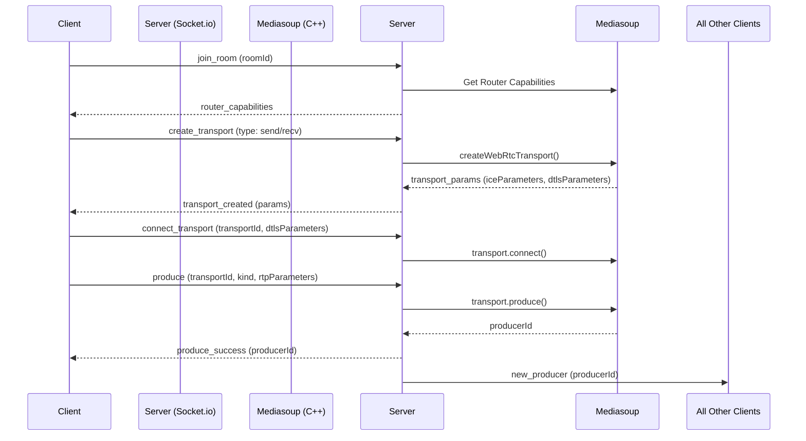

# Hướng dẫn chuyển đổi kiến trúc WebRTC: Mesh sang SFU (Mediasoup)

Tài liệu này phác thảo kế hoạch và thiết kế kỹ thuật để chuyển đổi tính năng cuộc gọi WebRTC từ cấu hình mạng lưới trực tiếp (Mesh/P2P) hiện tại sang Selective Forwarding Unit (SFU) sử dụng Mediasoup cho quy mô sản xuất thực tế.

---

## 1. So sánh Kiến trúc: Mesh vs. SFU

### Kiến trúc Mesh hiện tại (P2P)
* **Nguyên lý**: Mỗi người tham gia thiết lập kết nối WebRTC (PeerConnection) trực tiếp đến tất cả các thành viên khác.
* **Băng thông**: Tăng theo hàm bậc hai $O(N^2)$. Với $N$ người tham gia, mỗi người phải upload $N-1$ luồng và download $N-1$ luồng.
* **Giới hạn**: Không thể mở rộng quá 4-5 người tham gia do quá tải CPU của client (đặc biệt là thiết bị di động) và nghẽn băng thông upload của mạng gia đình.

```mermaid
graph TD
    subgraph Mesh Topology (P2P)
        A[Client A] <-->|P2P Connection| B[Client B]
        A <-->|P2P Connection| C[Client C]
        B <-->|P2P Connection| C
    end
```

### Kiến trúc SFU Mediasoup đề xuất
* **Nguyên lý**: Mỗi client chỉ thiết lập duy nhất 1 kết nối gửi (Producer Transport) lên SFU Server, và 1 kết nối nhận (Consumer Transport) để nhận luồng từ các thành viên khác.
* **Băng thông**: Băng thông upload là $O(1)$, băng thông download là $O(N-1)$.
* **Ưu điểm**:
  * Giảm tải cực lớn cho CPU Client vì chỉ cần mã hóa (encode) video duy nhất 1 lần.
  * Server SFU không giải mã/mã hóa lại video (khác với MCU), chỉ chuyển tiếp (forward) các gói tin RTP giúp độ trễ cực thấp (<100ms) và tối ưu hóa tài nguyên server.

```mermaid
graph TD
    subgraph SFU Topology (Mediasoup)
        ClientA[Client A] -->|1 Send Transport| Server[Mediasoup Server]
        ClientB[Client B] -->|1 Send Transport| Server
        ClientC[Client C] -->|1 Send Transport| Server
        Server -->|1 Recv Transport| ClientA
        Server -->|1 Recv Transport| ClientB
        Server -->|1 Recv Transport| ClientC
    end
```

---

## 2. Kế hoạch Triển khai Backend Mediasoup

Dịch vụ SFU sẽ chạy song song với máy chủ Node.js Express/Socket.io hiện tại.

### Cài đặt thư viện yêu cầu (Production)
```bash
npm install mediasoup socket.io
```

### Triển khai SFU Service (`sfuService.js`)
Service này sẽ quản lý vòng đời của:
1. **Mediasoup Worker**: Tiến trình C++ xử lý dữ liệu RTP cấp thấp.
2. **Mediasoup Router**: Phòng họp ảo xử lý định tuyến giữa các thành viên.
3. **WebRtcTransport**: Thiết lập cổng kết nối mạng (ICE, DTLS) để truyền/nhận media.

Xem mã nguồn cấu hình chi tiết tại [sfuService.js](file:///Users/admin/L%E1%BA%ADp%20tr%C3%ACnh/dev-project/backend/src/services/sfuService.js).

---

## 3. Luồng Tín Hiệu (Signaling Flow) qua Socket.io



---

## 4. Tích hợp phía Client (Frontend)

Sử dụng thư viện `mediasoup-client` để tương tác với SFU Server.

### Ví dụ luồng kết nối Client:
```javascript
import { Device } from 'mediasoup-client';

// 1. Tạo Device của Mediasoup
const device = new Device();

// 2. Load router capabilities nhận từ Server
await device.load({ routerRtpCapabilities });

// 3. Tạo Send Transport cho Audio/Video của mình
const sendTransport = device.createSendTransport(transportParams);
sendTransport.on('connect', ({ dtlsParameters }, callback, errback) => {
  socket.emit('connect_transport', { transportId: sendTransport.id, dtlsParameters }, callback);
});
sendTransport.on('produce', async ({ kind, rtpParameters }, callback, errback) => {
  socket.emit('produce', { transportId: sendTransport.id, kind, rtpParameters }, (producerId) => {
    callback({ id: producerId });
  });
});

// 4. Bắt đầu truyền Media
const videoTrack = localStream.getVideoTracks()[0];
const videoProducer = await sendTransport.produce({ track: videoTrack });
```
